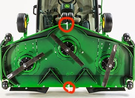
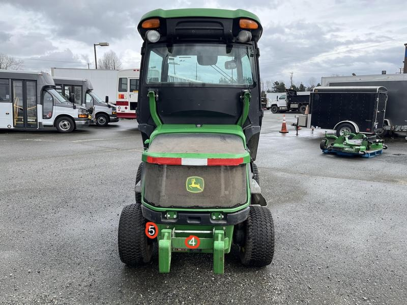
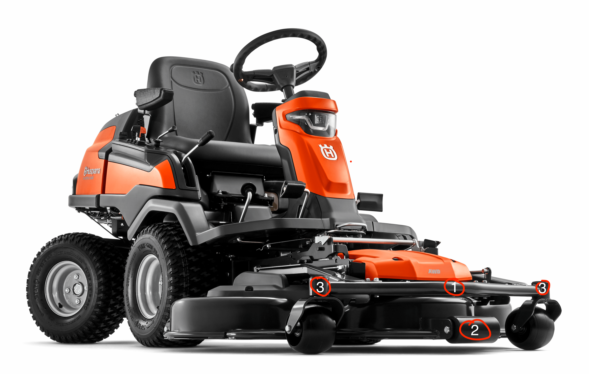
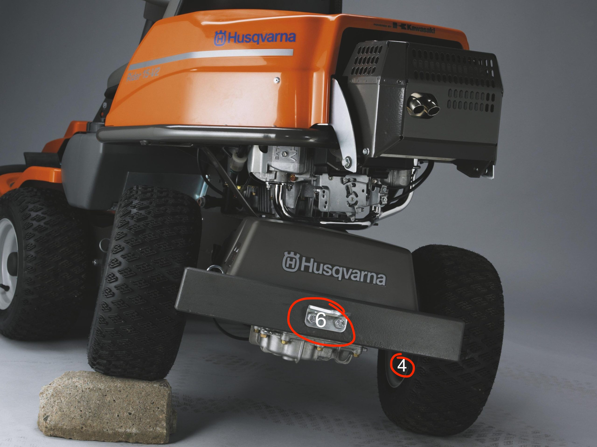

# Onderzoek sensoren aanbrengen

### Lijst van mogelijke sensoren

- Ultrasoon sensor 5V 15mA
- Infrarood afstandssensor 3.3V/5V 20mA
- Time of flight sensoren 3.0V/5V 40 mA

### Grasmaaiers modellen
John Deere 1585 TerrainCut (Maaidek 185cm)

Husqvarna R420TsX AWD (Maaidek 125cm)

### Limitaties
- Geen makkelijke aansluiting op het stroom van de grasmaaier accu.
- Omzetting van stroom past niet.
- Het is een bewegend apparaat wat voor problemen kan zorgen met kabels die los kunnen komen.
- Beweging van de grasmaaier kan voor inaccurate metingen zorgen
- Maaihoogte kan versteld worden.
- Beschadiging van de kabels.

### Opties

#### Bescherming kabels
1. Kabel goten maken
2. Kouzen om de kabels

#### Sensor locaties John Deere
1. Sensor onder het maai gedeelte
2. Sensor voor het maai gedeelte
3. Sensor op het wiel bij de maaier
4. Sensor achter bij de kenteken plaat
5. Sensor binnen bij het achterwiel
6. Sensor tussen de wielen
7. Sensor boven op het maai gedeelte
 
 

#### Sensor locaties Husqvarna
1. Sensor op de frame voor op de maaier
2. Sensor tussen de wieltjes
3. Sensor boven de wieltjes
4. Sensor binnen bij een wiel
5. Sensor onder het maaigedeelte
6. Sensor achter waar het kenteken zou zitten
 
 

### Afgewogen opties

#### Afgewogen sensor locaties John Deere
1. Sensor onder het maai gedeelte is niet handig om een aantal redenen namelijk:
    - Het heeft de hoogte niet om het gras te maaien als het nog niet gemaait is.
    - Het krijgt de messen die het gras maaien ook ervoor waardoor lengte niet goed gemeten kan worden.
    - De sensor kan niet goed aangesloten worden doordat de messen de kabels zouden snijden.
2. Sensor voor het maai gedeelte is beter, maar nog steeds niet perfect door de volgende redenen:
    - Het heeft goede hoogte om het gras te meten.
    - Het is instabiel door trillingen en stoten.
    - De hoogte kan verstelt worden, waardoor metingen misschien vanuit een fout punt gemeten wordt.
    - Het is buiten dus is er geen bescherming voor viezigheid.
3. Sensor op het wiel bij de maaier is de beste keuze voor het meten voor het gras gemaaid is.
    - Het is altijd dezelfde hoogte van de grond, waardoor metingen consistent zijn.
    - Het heeft de goed hoogte voor het meten.
    - Het wordt snel vies.
    - Het is stabiel genoeg.
4. Sensor achter bij de kenteken plaat is één van de beter opties om het gras na afloop te meten
    - Het is bijna altijd de zelfde afstand van de grond. (suspensie kan de hoogte wat veranderen)
    - Het is stabiel.
    - Het wordt niet snel vies.
    - Het is misschien te hoog.
5. Sensor binnen bij het achterwiel is ook één van de opties die goed zou kunnen om het gras na afloop te meten
    - Het is de goede hoogte.
    - Beschermt tegen regen.
    - Wordt snel vies.
    - Het is stabiel.
    - Altijd dezelfde hoogte van de grond.
6. Sensor tussen de wielen
    - De sensor zou moeilijk aangesloten kunnen worden.
    - Niet stabiel.
    - De hoogte kan versteld worden.
7. Sensor boven op het maai gedeelte
    - Niet stabiel.
    - Hoogte kan versteld worden.
    - Meten is moeilijk, want je moet met hoeken werken.

#### Conclusie John deere
Voor het maaien
 
De optie die nu overgebleven is 3, dit komt omdat het van alle opties die er waren de beste is. De redenen zijn stabiliteit en consistentie.

Na het maaien
 
De twee opties die hier zijn uitgekomen zijn opties 4 en 5. Dit komt ook door stabiliteit en consistentie, maar tussen de twee zitten wat verschillen waarvoor we eerst moeten testen om daar een definitieve oplossing over te nemen.

#### Afgewogen sensor locaties Husqvarna
1. Sensor op de frame voor op de maaier
    - Dit is altijd de zelfde hoogte.
    - Niet erg stabiel
    - Hoog genoeg om het gras te meten voordat je hebt gemaaid
2. Sensor tussen de wieltjes
    - Dit is altijd de zelfde hoogte.
    - Het is Stabiel
    - Niet altijd hoog genoeg om het gras te meten voordat je hebt gemaaid
3. Sensor boven de wieltjes
    - Dit is altijd de zelfde hoogte.
    - Niet erg stabiel
    - Hoog genoeg om het gras te meten voordat je hebt gemaaid
4. Sensor binnen bij een wiel
    - Het is de goede hoogte.
    - Beschermt tegen regen.
    - Wordt snel vies.
    - Het is stabiel.
    - Altijd dezelfde hoogte van de grond.
    - Moeilijk aan te sluiten
5. Sensor onder het maaigedeelte
    - Het heeft de hoogte niet om het gras te maaien als het nog niet gemaait is.
    - Het krijgt de messen die het gras maaien ook ervoor waardoor lengte niet goed gemeten kan worden.
    - De sensor kan niet goed aangesloten worden doordat de messen de kabels zouden snijden.
6. Sensor achter waar het kenteken zou zitten
    - Het is bijna altijd de zelfde afstand van de grond. (suspensie kan de hoogte wat veranderen)
    - Het is stabiel.
    - Het wordt niet snel vies.

#### Conclusie Husqvarna
Voor het maaien
 
Er zijn een paar opties om het voor het maaien te meten, namelijk opties 1 en 3. Er is niet veel verschil tussen de twee dus deze kunnen omgewisselt worden.

Na het maaien
De beste optie om het gras te meten na het maaien is de plek waar de kenteken zou moeten zitten. Dit is stabiel, hoog genoeg en niet snel vies.
 

#### Bronnen
https://www.circuits-diy.com/hw201-infrared-ir-sensor-module/
https://cdn.sparkfun.com/datasheets/Sensors/Proximity/HCSR04.pdf
https://www.st.com/resource/en/datasheet/vl53l0x.pdf
https://pip-assets.raspberrypi.com/categories/1088-raspberry-pi-pico-2-w/documents/RP-008304-DS-1-pico-2-w-datasheet.pdf?disposition=inline
https://aravidis.gr/pub/media/wysiwyg/R420TsXAWD.pdf?srsltid=AfmBOopwXDhtXF6lC7dkM8-0QcIPRnI6WJ3c1Gs3q6fNqlKsyQwMmV8x
https://www.deere.com/en/mowers/commercial-mowers/front-mowers/1585-terraincut-mower/
https://techinfo-omview.apps-prod-vpn.us.e06.c01.johndeerecloud.com/omview/omuc30515/09001faa81e66534